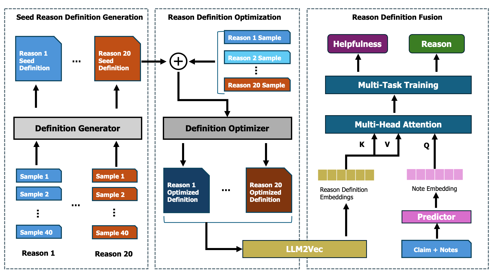

# Helpfulness-FCExp

<div align="center">

<h1>COMMUNITYNOTES</h1>
<p><em>A Dataset for Exploring the Helpfulness of Fact-Checking Explanations</em></p>


[](#python)


</div>

This repo contains code and data access instructions for the paper [COMMUNITYNOTES: A Dataset for Exploring the Helpfulness of Fact-Checking Explanations](https://aclanthology.org/2026.findings-eacl.71/).

## 🧩 Background
- Fact-checking on major platforms, such as X, Meta, and TikTok, is shifting from expert-driven verification to **a community-based setup**, where users contribute explanatory notes to clarify why a post might be misleading.
- An important challenge here is determining **whether an explanation is helpful** for understanding real-world claims and the reasons why, which remains largely under-explored in prior research. 
- In practice, most community notes remain **unpublished due to slow community annotation**, and the reasons for helpfulness lack clear definitions.

## ✨ Features
- We introduce the task of predicting both the helpfulness of explanatory notes and the reason for this. We present [COMMUNITYNOTES](https://github.com/ruixing76/Helpfulness-FCExp), a large-scale multilingual dataset of 104k posts with user-provided notes and helpfulness labels. 
- We further propose a [framework](#Framework) that automatically generates and improves reason definitions via automatic prompt optimization, and integrate them into prediction. 
- Our experiments show that the optimized definitions can improve both helpfulness and reason prediction. Finally, we show that the helpfulness information are beneficial for existing fact-checking systems.

## 🏗️ Framework
<p align="center" width="100%">
    <a></a>
</p>

We generate and optimize reason definitions following the first two steps in the framework: (1) **Seed reason definition generation** and (2) **Reason definition optimization**. In the first step, we randomly sample 40 instances for each category. We then prompt the GPT-4o model to generate candidate definitions. In the second step, we employ PromptAgent, a Monte Carlo Tree Search (MCTS)-based automatic prompt optimization framework, to refine the initial definitions. 
After obtaining the optimized helpfulness reason definitions, we proceed to incorporate this information into the predictor's training process. The core idea is that, for a given note associated with a claim, the predictor should attend more strongly to the relevant helpfulness reasons.


## ⚙️ Installation
```bash
git clone git@github.com:ruixing76/Helpfulness-FCExp.git 
cd Helpfulness-FCExp
pip install -r requirement.txt
```

## 📊 Data
### COMMUNITYNOTES
Due to legal restrictions, we are unable to freely distribute the dataset online. Please complete the [request form](https://forms.office.com/r/SjyRxdL9Fv) to review the data agreement and apply for access to COMMUNITYNOTES.

We actively review all requests. If you have successfully submitted the form but have not received a response within 7 days, please contact us via rui.xing@student.unimelb.edu.au.

### CLIMATE-FEVER
CLIMATE-FEVER dataset is publicly available and can be downloaded from [here](https://github.com/tdiggelm/climate-fever-dataset).

### SufficientFacts
SufficientFacts dataset is publicly available can be downloaded from [here](https://huggingface.co/datasets/copenlu/sufficient_facts).

## ⏳ Training & Evaluation
```python
python train_plm_trainer_multitask_mha.py 
    --model_name [MODEL_NAME] 
    --max_length 512 
    --batch_size 64 
    --epochs 10 
    --lr 2e-5 
    --output_dir ./output-plm-mha 
    --save_dir ./save-plm-mha 
    --label_embeddings_path [LABEL_EMBEDDINGS] 
    --report_to wandb 
    --run_name [EXAMPLE_PROJ_NAME] 
```
For MODEL_NAMES, please refer to `utils/config.py`.

## ⏳ Generalization Experiments
We test Generalization of the Explanation Helpfulness using the following scripts.
```python
python test_generalization_sufficientfact.py 
    --model_name [MODEL_NAME] 
    --device [DEVICE] 
    --use_reason_based_prediction 
    --data_path [DATA_PATH] 
    --save_dir [SAVE_DIR] 
    --output_file [OUTPUT_FILE] 
```

For comparison, please use the following script to train models from scratch on SufficientFacts.
```python
python train_sufficient_fact.py 
    --model_name [MODEL_NAME] 
    --train_data [TRAIN_DATA] 
    --test_data [TEST_DATA] 
    --max_length 512 
    --batch_size 64 
    --epochs 10 
    --lr 2e-5 
```

For testing on CLIMATE-FEVER, please use the following script:
```python
python fc_climatefever.py 
--model-name [SLM_MODEL_NAME] 
--llm-model [LLM_MODEL_NAME]   
--output [OUTPUT_FILENAME] 
```
You can find the prompt in `utils/prompts.py`.

## 📖 Citation
Please cite our work if you use the dataset, and consider giving our repository a ⭐.

```bibtex
@inproceedings{xing-etal-2026-communitynotes,
    title = "{COMMUNITYNOTES}: A Dataset for Exploring the Helpfulness of Fact-Checking Explanations",
    author = "Xing, Rui  and
      Nakov, Preslav  and
      Baldwin, Timothy  and
      Lau, Jey Han",
    editor = "Demberg, Vera  and
      Inui, Kentaro  and
      Marquez, Llu{\'i}s",
    booktitle = "Findings of the {A}ssociation for {C}omputational {L}inguistics: {EACL} 2026",
    month = mar,
    year = "2026",
    address = "Rabat, Morocco",
    publisher = "Association for Computational Linguistics",
    url = "https://aclanthology.org/2026.findings-eacl.71/",
    doi = "10.18653/v1/2026.findings-eacl.71",
    pages = "1390--1411",
    ISBN = "979-8-89176-386-9",
}
```


## Authors
Developed by **Rui Xing**, Preslav Nakov, Timothy Baldwin and Jey Han Lau \
Affiliations: The University of Melbourne, MBZUAI

Any questions please contact: \
rui.xing@student.unimelb.edu.au

